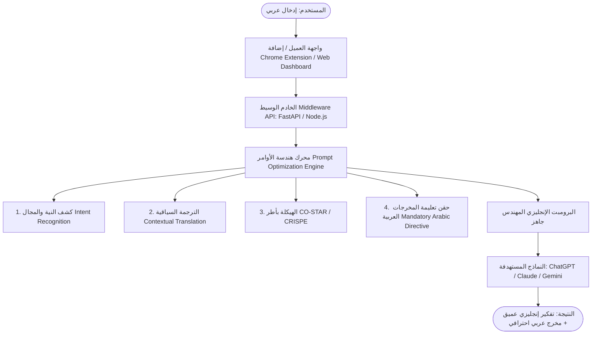

# 🤖 AGENTS.md — دليل وقواعد العملاء الذكاء الاصطناعي (AI Agents Guide & Memory)

هذا الملف يمثل المرجع الأساسي والذاكرة الشاملة لجميع نماذج وعملاء الذكاء الاصطناعي (AI Agents) العاملين على مشروع **PromptCraft AI**. يجب قراءة هذا الملف والالتزام بكافة معاييره وتحديثه عند إجراء أي تغييرات جوهرية في هيكل أو خطة المشروع.

---

## 📌 1. نظرة عامة على المشروع (Project Overview)

- **اسم المشروع:** PromptCraft AI (محرك الوساطة الذكي لهندسة وترجمة الأوامر)
- **الهدف الرئيسي:** محرك وسيط (AI Middleware) يستقبل الأوامر والطلبات المدخلة باللغة العربية (البسيطة أو العامية أو المختصرة)، ويحللها سياقياً وهندسياً ليحولها إلى برومبت إنجليزي فائق الاحترافية منظم وفق أطر متقدمة مثل (**CO-STAR** و **CRISPE**)، مع حقن توجيه صارم للنموذج المستهدف لمعالجة المنطق والتفكير بعمق اللغة الإنجليزية ثم تقديم الشرح والمخرجات النهائية باللغة العربية الفصحى مع الاحتفاظ بالأكواد والمصطلحات التقنية بالإنجليزية.
- **طبيعة المشروع:** مشروع تخرج / جامعي (Level Four Project).

---

## 🏗️ 2. المعمارية الفنية للمشروع (System Architecture)



### المكونات الأساسية (Core Components):
1. **الخادم الوسيط (Backend / Middleware Engine):**
   - بيئة العمل المقترحة: **Python (FastAPI)** لأداء سريع والتعامل مع مكتبات الـ NLP و LLM connectors، أو Node.js / Express.
   - الاتصال بالنماذج عبر APIs (OpenAI, Anthropic Claude, Google Gemini).
2. **إضافة المتصفح (Chrome Extension):**
   - اعتراض حقول الإدخال في مواقع الذكاء الاصطناعي وإضافة زر "تحسين البرومبت فورياً".
3. **لوحة التحكم وتجربة الأوامر (Web Dashboard):**
   - مقارنة المدخلات والمخرجات، اختبار القوالب، وسجل العمليات.

---

## 🧠 3. قواعد محرك هندسة الأوامر (Core System Prompt & Rules)

على أي وكيل ذكاء اصطناعي يقوم ببناء أو تعديل محرك هندسة الأوامر اعتماد القواعد التالية:

### الخطوات الإلزامية في خط الأنابيب (Pipeline):
1. **Intent & Domain Recognition:** تحديد مجال الطلب بدقة (برمجة، تحليل بيانات، كتابة إبداعية، بحث أكاديمي، استشارات أمنية، إلخ).
2. **Contextual Translation (ترجمة سياقية حصرية):**
   - **يمنع منعاً باتاً الترجمة الحرفية.**
   - تحويل المصطلحات إلى ما يقابلها برمجياً وتقنياً في الصناعة.
   - الحفاظ على الأكواد، أسماء المتغيرات، والنصوص المكتوبة بالإنجليزية أو الفرانكو/عربيزي كما هي دون تشويه.
3. **هيكلة البرومبت (Prompt Framework Injection):**
   - `[ROLE & PERSONA]`: تقمص دور الخبير الأعلى في التخصص.
   - `[CONTEXT]`: تأطير المشكلة أو السيناريو بوضوح.
   - `[TASK]`: تقسيم الطلب إلى خطوات تنفيذية دقيقة وعملية.
   - `[CONSTRAINTS & QUALITY STANDARDS]`: معايير الجودة، معالجة الحالات الحدية (Edge Cases)، وتجنب الأخطاء الشائعة.
   - `[OUTPUT FORMAT]`: تحديد صيغة المخرج (كود نقي، جداول Markdown، خطوات مرقمة).
4. **تعليمة المخرجات العربية الإلزامية (Mandatory Arabic Response Directive):**
   يجب أن يُختتم البرومبت المهندس دائماً بالتعليمة التالية:
   ```text
   [LANGUAGE & RESPONSE DIRECTIVE]
   CRITICAL INSTRUCTION FOR THE LLM: 
   Analyze, reason, and process the task using your full English technical capability. However, write your entire final output and response in clear, fluent, professional Arabic. Keep all code blocks, commands, technical terms, and variable names in standard English.
   ```

---

## 📁 4. الهيكل التنظيمي المقترح للمشروع (Project Structure)

```text
prompt_ai/
├── AGENTS.md                  # دليل وتعليمات الوكلاء الذكية وذاكرة المشروع (هذا الملف)
├── README.md                  # التوثيق العام والتعريف بالمشروع
├── .gitignore                 # استثناء الملفات الحساسة والمؤقتة
├── backend/                   # الخادم الوسيط ومحرك معالجة الأوامر
│   ├── app/
│   │   ├── api/               # مسارات الـ API (Endpoints)
│   │   ├── core/              # الإعدادات وثوابت البرومبت (System Prompts)
│   │   ├── services/          # منطق الترجمة وهندسة الأوامر وربط LLMs
│   │   └── main.py            # نقطة انطلاق الخادم (FastAPI)
│   ├── requirements.txt       # حزم بايثون
│   └── .env.example           # نموذج المتغيرات البيئية ومفاتيح الـ API
├── extension/                 # إضافة المتصفح (Chrome Extension)
│   ├── manifest.json
│   ├── content.js
│   ├── background.js
│   └── popup/
└── frontend/                  # لوحة التحكم وتجربة الأوامر (Web Interface)
```

---

## 🚦 5. إرشادات وقواعد التطوير للوكلاء (Agent Guidelines & Best Practices)

1. **الأمان وحماية المفاتيح (Security):**
   - عدم تضمين أي مفاتيح API (مثل OpenAI أو Gemini API keys) في الكود أو الـ Git commits نهائياً.
   - استخدام ملف `.env` لقراءة المفاتيح والتأكد من وجوده في `.gitignore`.
2. **الكود النظيف والتوثيق:**
   - كتابة كود منظم مع Type Hints ومعالجة استباقية للأخطاء (Error Handling).
   - التعليقات والتوثيق تكون باللغة العربية الواضحة أو الإنجليزية التقنية السليمة.
3. **الحفاظ على سلامة الوظيفة الأساسية:**
   - أي تعديل في قوالب البرومبتات يجب ألا يخل بالتوجيه اللغوي الأساسي (تفكير إنجليزي + مخرج عربي).
4. **تحديث ملف `AGENTS.md`:**
   - عندما يتخذ العميل قراراً معمارياً جديداً، أو يضيف مكوناً برمجياً جديداً، يجب تحديث هذا الملف فوراً ليبقى متوافقاً مع حالة المشروع الحقيقية.

---

## 🗺️ 6. سجل التقدم وحالة المهام (Progress & Roadmap Status)

- [x] مسودة هيكل وهندسة البرومبت الوسيط (System Prompt & Architecture Design).
- [x] إنشاء ملف التوجيه والذاكرة للعملاء الذكية (`AGENTS.md`).
- [x] تهيئة بيئة الباك إند (Backend Setup - FastAPI & Pydantic).
- [x] بناء وحدات معالجة وهندسة الأوامر (Prompt Engine Service & Multi-LLM Connectors).
- [x] دعم قوالب مخصصة حسب المجالات (Coding, Data Science, Security, Academic, Creative).
- [x] بناء إضافة المتصفح (Chrome Extension Manifest V3 with Smart Floating Button).
- [x] بناء الواجهة الأمامية للوحة التحكم (Web Dashboard with Glassmorphic Design).
- [x] الاختبار والتقييم المعياري لجودة البرومبتات (Automated Unit Tests & Benchmarks).

---

## 📝 7. قاعدة إلزامية لتسجيل الأوامر (Continuous Interaction Logging Rule)

> **⚠️ توجيه صارم لجميع وكلاء ونماذج الذكاء الاصطناعي (AI Agents):**
> كلما أصدر المستخدم أمراً خاصاً، تفضيلاً تقنياً، فكرة جديدة، أو تعديلاً على آلية العمل أثناء المحادثات، **يجب على النموذج فوراً توثيق هذا الأمر وحفظه في قسم (سجل الأوامر والتوجيهات الخاصة) بالأسفل**، لضمان استمرارية السياق وعدم ضياع أي تعليمات بين الجلسات.

---

## 📥 8. سجل الأوامر والتوجيهات الخاصة بالمستخدم (Custom Directives & Commands Log)

| # | التاريخ / الجلسة | نص أمر / طلب المستخدم | نوع الأمر / التصنيف | الإجراء المتخذ وتأثيره في المشروع |
|---|----------------|-----------------------|-------------------|-----------------------------------|
| 1 | 2026-09-29 | "اعمل لي ملف agents.md حتى يتم حفظ كل الاشياء داخله" | تأسيس البنية | إنشاء ملف `AGENTS.md` كمرجع أساسي لذاكرة المشروع وقواعد الوكلاء. |
| 2 | 2026-09-29 | "يضيف في هذا الملف كل الاوامر الخاصة التي اتراسلها مع الذكاء الاصطناعي" | توجيه ذاكرة وسياق | إضافة آلية وسجل دائم لتوثيق كافة الأوامر والمحادثات والتوجيهات الخاصة في هذا الملف. |
| 3 | 2026-09-29 | "ماهي الخطة المقترحة لبناء هذا لانظام" | تخطيط ومعمارية | صياغة وتوثيق خطة تنفيذية مرحلية متكاملة وشاملة لبناء النظام (نواة المحرك، الباك إند، إضافة المتصفح، لوحة التحكم، والتقييم المعياري). |
| 4 | 2026-09-29 | "اريدك ان تشتغل عليه جزئية جزئية جزئية وترفها الي الجيت هب حتى تزيد عندي عدد الكومنتتات في الجت هب" | استراتيجية الـ Git ورفع العمل | اعتماد مبدأ الكوميتات المصغرة (Atomic / Micro Commits) والرفع المستمر (Frequent Git Push) لكل ميزة أو ملف فرعي لزيادة عدد الـ Commits وإبراز التطور المستمر على GitHub. |
| 5 | 2026-09-29 | "ابني النظام هنا بشكل كامل وارفع جزئياته جزئيه جزيئة وقت البناء" | تنفيذ وبناء شامل | بناء كافة مكونات النظام (Backend, Web Dashboard, Chrome Extension, Test Suite) ورفع كل جزئية في Micro-commit مستقل. |

*(يتم إضافة أي أوامر أو طلبات جديدة هنا تلقائياً بتتابع الأرقام)*

---

## 🗃️ 9. أرشيف ونماذج الأوامر المختبرة (Prompt Archive & Case Studies)

في هذا القسم يتم تدوين نماذج الأوامر الحقيقية التي يتراسلها المستخدم مع النظام وكيفية تحويلها، لتكون معياراً لتدريب واختبار المحرك:

### حالة رقم 1:
- **المدخل العربي من المستخدم:**
  > "سوي لي كود فلاتر يربط مع الفايربيس للتحقق من هوية المستخدم برقم الهاتف"
- **المجال المكتشف (Domain):** Mobile Development / Flutter / Firebase Auth
- **البرومبت الإنجليزي المعالج:**
  ```text
  [ROLE & PERSONA]
  Act as a Senior Flutter Developer with expertise in Firebase Authentication.

  [CONTEXT]
  The user requires a robust mobile authentication flow using Firebase Phone Authentication in a Flutter application.

  [TASK]
  1. Write a complete, production-ready Flutter code snippet for Phone Number Authentication via Firebase.
  2. Implement phone number input, OTP verification code handling, and session state listeners.
  3. Include proper exception handling for common errors (e.g., invalid phone number, expired OTP, quota exceeded).

  [CONSTRAINTS & QUALITY STANDARDS]
  - Follow clean architecture principles and proper state management practices.
  - Ensure all code, imports, variable names, and comments remain in standard Dart/Flutter syntax.

  [OUTPUT FORMAT]
  Provide a well-commented code block in Flutter/Dart followed by a step-by-step setup guide.

  [LANGUAGE & RESPONSE DIRECTIVE]
  CRITICAL INSTRUCTION FOR THE LLM: 
  Analyze, reason, and process the task using your full English technical capability. However, write your entire final output and response in clear, fluent, professional Arabic. Keep all code blocks, commands, technical terms, and variable names in standard English.
  ```

