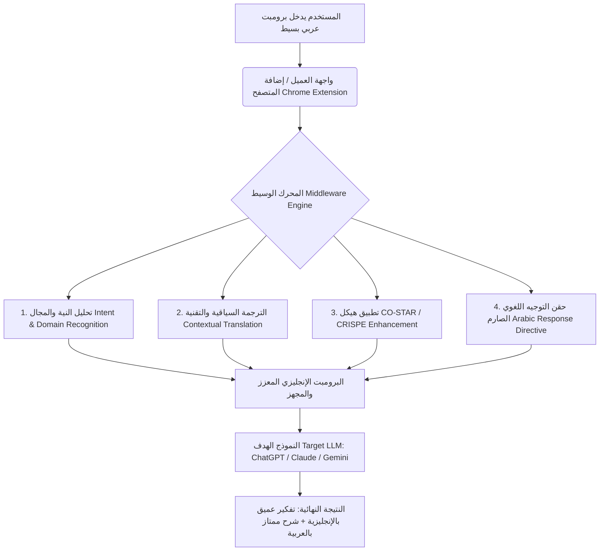

# 🧠 PromptCraft AI (محرك الوساطة الذكي لهندسة وترجمة الأوامر)
### *Smart Arabic-to-English Prompt Engineering & Context Translation Middleware*

[](LICENSE)
[]()
[]()

---

## 🌟 نظرة عامة على المشروع (Overview)

**PromptCraft AI** هو محرك وسيط ذكي (AI Middleware) يهدف إلى سد الفجوة بين المستخدمين الناطقين باللغة العربية والقدرات الاستنتاجية الهائلة لنماذج الذكاء الاصطناعي التوليدي (LLMs).

يقوم النظام باستقبال الأوامر والطلبات المكتوبة باللغة العربية (سواء كانت بسيطة، عامية، أو مختصرة)، ويقوم بتحليلها سياقياً وهندستها فورياً وتحويلها إلى **برومبت إنجليزي فائق الاحترافية** منظم ومبني على أحدث أطر هندسة الأوامر (مثل **CO-STAR** و **CRISPE**)، مع تزويده بتعليمة حاسمة للنموذج المستهدف لمعالجة المنطق بالإنجليزية وتقديم الشرح والمخرجات باللغة العربية الفصحى مع بقاء الكود والمصطلحات التقنية بالإنجليزية.

---

## 🎯 المشكلة التي يعالجها المشروع (Problem Statement)

1. **تفاوت جودة الاستدلال اللغوي:** تم تدريب معظم نماذج الذكاء الاصطناعي العالمية على مجموعات بيانات إنجليزية ضخمة تفوق غيرها بمراحل، مما يجعل تفكير النماذج وحلها للمشكلات التقنية والبرمجية المعقدة أكثر دقة بمرات عديدة عند التوجيه باللغة الإنجليزية مقارنة بالعربية.
2. **ضعف صياغة البرومبت لدى أغلب المستخدمين:** يميل المستخدم عادةً إلى كتابة أسطر قصيرة غير مهيكلة تفتقر إلى تحديد الدور (Persona)، السياق (Context)، الشروط والمعايير (Constraints)، وصيغة المخرجات (Output Format).
3. **مشاكل الترجمة الحرفية:** برامج الترجمة التقليدية تشوه المصطلحات التقنية وأسماء المتغيرات والأكواد عند ترجمتها إلى الإنجليزية.

---

## 💡 الحل والقيمة المضافة (The Solution & Core Value)

يعمل المشروع كطبقة وسيطة خفية أو ظاهرة (عبر API أو إضافة متصفح):
* **تفكير إنجليزي عميق + مخرجات عربية سلسة:** استغلال كامل القوة المعرفية للنموذج بالإنجليزية دون التضحية بلغتنا الأم في المخرجات.
* **هيكلة تلقائية بمعايير النخبة:** تحويل سطر واحد مكتوب بعفوية إلى برومبت استشاري شامل يحتوي على كافة التفاصيل الحساسة.
* **حفظ سلامة المصطلحات البرمجية والتقنية:** عدم ترجمة الأكواد والرموز الحسابية وحمايتها بدقة.

---

## 🏗️ معمارية النظام ومراحل المعالجة (Pipeline & Architecture)



### خطوات خط الأنابيب (Pipeline Steps):
1. **Intent & Domain Recognition:** كشف نوع المهمة (برمجة، تصحيح أخطاء، تصميم معماري، بحث علمي، إلخ).
2. **Contextual Translation:** استبدال الأوصاف التعبيرية بمصطلحات تقنية دقيقة مع الاحتفاظ بالأكواد والـ Arabizi دون تشويه.
3. **Prompt Framework Injection:**
   - **`[ROLE & PERSONA]`**: تقمص دور الخبير في المجال.
   - **`[CONTEXT]`**: شرح المشكلة وسياق الاستخدام.
   - **`[TASK]`**: خطوات عملية دقيقة وتفصيلية للمهمة.
   - **`[CONSTRAINTS & STANDARDS]`**: التعامل مع الحالات الحرجة ومعايير الكود النظيف.
   - **`[OUTPUT FORMAT]`**: طريقة العرض المطلوبة (Markdown, كتل برمجية، جداول).
4. **Mandatory Arabic Output Rule:** إلزام النموذج بتقديم المخرجات النهائية باللغة العربية مع إبقاء الأكواد بالإنجليزية.

---

## 🔬 مثال واقعي قبل وبعد المعالجة (Real-world Example)

### المدخل العربي من المستخدم (Input):
> *"سوي لي كود فلاتر يربط مع الفايربيس للتحقق من هوية المستخدم برقم الهاتف"*

### المخرج المولد عبر المحرك الوسيط (Optimized Prompt):
```markdown
[ROLE & PERSONA]
Act as a Senior Flutter Developer with expertise in Firebase Authentication.

[CONTEXT]
The user requires a robust mobile authentication flow using Firebase Phone Authentication in a Flutter application.

[TASK]
1. Write a complete, production-ready Flutter code snippet for Phone Number Authentication via Firebase.
2. Implement phone number input, OTP verification code handling, and session state listeners.
3. Include proper exception handling for common errors (e.g., invalid phone number, expired OTP, quota exceeded).

[CONSTRAINTS & QUALITY STANDARDS]
- Follow clean architecture principles and proper state management practices.
- Ensure all code, imports, variable names, and comments remain in standard Dart/Flutter syntax.

[OUTPUT FORMAT]
Provide a well-commented code block in Flutter/Dart followed by a step-by-step setup guide.

[LANGUAGE & RESPONSE DIRECTIVE]
CRITICAL INSTRUCTION FOR THE LLM: 
Analyze, reason, and process the task using your full English technical capability. However, write your entire final output and response in clear, fluent, professional Arabic. Keep all code blocks, commands, technical terms, and variable names in standard English.
```

---

## 🛠️ مكونات المشروع التقنية (Technical Stack)

- **الواجهة الأمامية والعميل (Client Layer):**
  - **إضافة متصفح (Chrome Extension):** تعمل على اعتراض واجهات المحادثة (ChatGPT, Claude, Gemini) وتتيح زراً لتعزيز البرومبت فورياً.
  - **تطبيق ويب (Web Dashboard):** واجهة لاختبار وتجربة ومقارنة جودة البرومبتات.
- **الخادم الوسيط (Backend / Middleware Engine):**
  - **Python (FastAPI)** أو **Node.js**: خفيف وسريع لمعالجة الطلبات بالتزامن.
  - **LLM Connectors**: تكامل مباشر مع (OpenAI / Anthropic / Google Gemini) باستخدام مفاتيح الـ API.
  - **System Prompt Templates**: قوالب ديناميكية متخصصة بحسب نوع المهمة المكتشفة.

---

## 🗺️ خارطة الطريق (Roadmap)

- [x] تصميم مسودة النظام ومهندس الأوامر (System Prompt Architecture).
- [ ] بناء خادم الـ API الوسيط (FastAPI / Express).
- [ ] إضافة قوالب متقدمة حسب المجالات (Coding, Data Science, Security, Academic Writing).
- [ ] بناء إضافة متصفح Chrome بنقرة واحدة (One-Click Prompt Optimizer).
- [ ] إضافة خاصية حفظ سجل الأوامر والمقارنة بين النتائج (History & Benchmark).

---

## 📄 الترخيص (License)
هذا المشروع مرخص تحت رخصة [MIT License](LICENSE).
